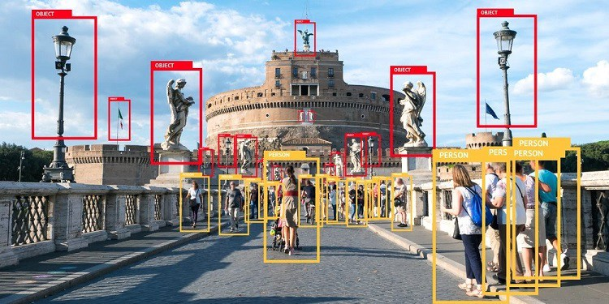

# Image Classifier using Open CV and Python

## Introduction

Image classifier includes small apps for image identification, sorting, resizing, modification, storage, and step-by-step guidance to build versatile classifiers. 

## Technology

Tech Stack: Python, Object-Oriented Design, Jupyter Notebook, Data Visualization, Localization, Data Structures, Algorithms, Open CV
 
